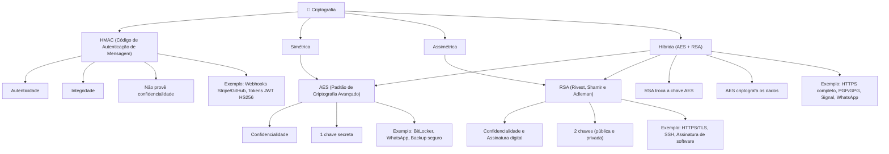

# Diagrama de Criptografias

```mermaid
flowchart TD
    CRIPTO["🔐 Criptografia"]

    CRIPTO --> HMAC["HMAC (Código de Autenticação de Mensagem)"]
    CRIPTO --> SIM["Simétrica"]
    CRIPTO --> ASSIM["Assimétrica"]
    CRIPTO --> HYB["Híbrida (AES + RSA)"]

    SIM --> AES["AES (Padrão de Criptografia Avançado)"]
    ASSIM --> RSA["RSA (Rivest, Shamir e Adleman)"]
    HYB --> AES
    HYB --> RSA

    HMAC --> H1["Autenticidade"]
    HMAC --> H2["Integridade"]
    HMAC --> H3["Não provê confidencialidade"]
    HMAC --> HEX1["Exemplo: Webhooks Stripe/GitHub, Tokens JWT HS256"]

    AES --> A1["Confidencialidade"]
    AES --> A2["1 chave secreta"]
    AES --> AEX1["Exemplo: BitLocker, WhatsApp, Backup seguro"]

    RSA --> R1["Confidencialidade e Assinatura digital"]
    RSA --> R2["2 chaves (pública e privada)"]
    RSA --> REX1["Exemplo: HTTPS/TLS, SSH, Assinatura de software"]

    HYB --> HY1["RSA troca a chave AES"]
    HYB --> HY2["AES criptografa os dados"]
    HYB --> HYEX1["Exemplo: HTTPS completo, PGP/GPG, Signal, WhatsApp"]
```
