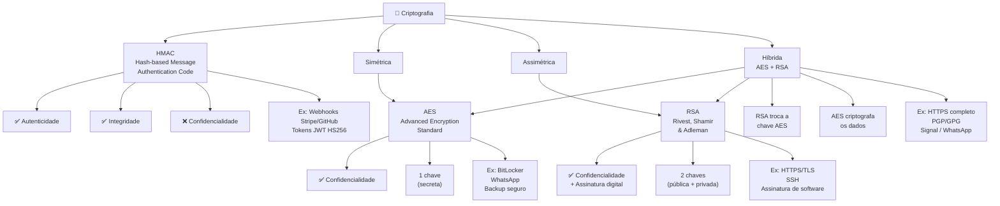

# Diagrama de Criptografias

```mermaid
flowchart TD
    CRIPTO["🔐 Criptografia"]

    CRIPTO --> HMAC["HMAC\nHash-based Message\nAuthentication Code"]
    CRIPTO --> SIM["Simétrica"]
    CRIPTO --> ASSIM["Assimétrica"]
    CRIPTO --> HYB["Híbrida\nAES + RSA"]

    SIM --> AES["AES\nAdvanced Encryption\nStandard"]
    ASSIM --> RSA["RSA\nRivest, Shamir\n& Adleman"]
    HYB --> AES
    HYB --> RSA

    HMAC --> H1["✅ Autenticidade"]
    HMAC --> H2["✅ Integridade"]
    HMAC --> H3["❌ Confidencialidade"]
    HMAC --> HEX1["Ex: Webhooks Stripe/GitHub\nTokens JWT HS256"]

    AES --> A1["✅ Confidencialidade"]
    AES --> A2["1 chave\n(secreta)"]
    AES --> AEX1["Ex: BitLocker\nWhatsApp\nBackup seguro"]

    RSA --> R1["✅ Confidencialidade\n+ Assinatura digital"]
    RSA --> R2["2 chaves\n(pública + privada)"]
    RSA --> REX1["Ex: HTTPS/TLS\nSSH\nAssinatura de software"]

    HYB --> HY1["RSA troca a\nchave AES"]
    HYB --> HY2["AES criptografa\nos dados"]
    HYB --> HYEX1["Ex: HTTPS completo\nPGP/GPG\nSignal / WhatsApp"]
```
